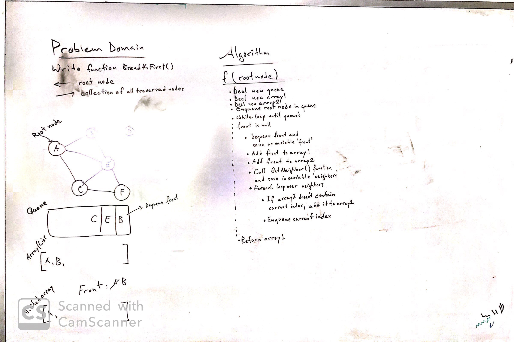
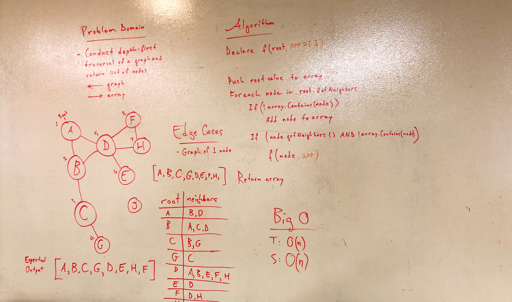

# Graphs

Implement a Graph

## Challenge
Implement your own Graph. The graph should be represented as an adjacency list, and should include the following methods:

* AddNode()
Adds a new node to the graph
Takes in the value of that node
Returns the added node
* AddEdge()
Adds a new edge between two nodes in the graph
Include the ability to have a “weight”
Takes in the two nodes to be connected by the edge
Both nodes should already be in the Graph
* GetNodes()
Returns all of the nodes in the graph as a collection (set, list, or similar)
GetNeighbors()
Returns a collection of nodes connected to the given node
Takes in a given node
Include the weight of the connection in the returned collection
* Size()
Returns the total number of nodes in the graph

## Approach & Efficiency
<!-- What approach did you take? Why? What is the Big O space/time for this approach? -->

## API
<!-- Description of each method publicly available in your Graph -->

# Breadth-First Traversal of a Graph
Implement a breadth-first traversal on a graph.

## Challenge
Extend your graph object with a breadth-first traversal method that accepts a starting node. Without utilizing any of the built-in methods available to your language, return a collection of nodes in the order they were visited. Display the collection.

## Approach & Efficiency
<!-- What approach did you take? Why? What is the Big O space/time for this approach? -->

## Solution

# Depth First Traversal
Conduct a depth first preorder traversal on a graph

## Challenge
Create a function that accepts an adjacency list as a graph, and conducts a depth first traversal. Without utilizing any of the built-in methods available to your language, return a collection of nodes in their pre-order depth-first traversal order.

## Approach & Efficiency
<!-- What approach did you take? Why? What is the Big O space/time for this approach? -->

## Solution

